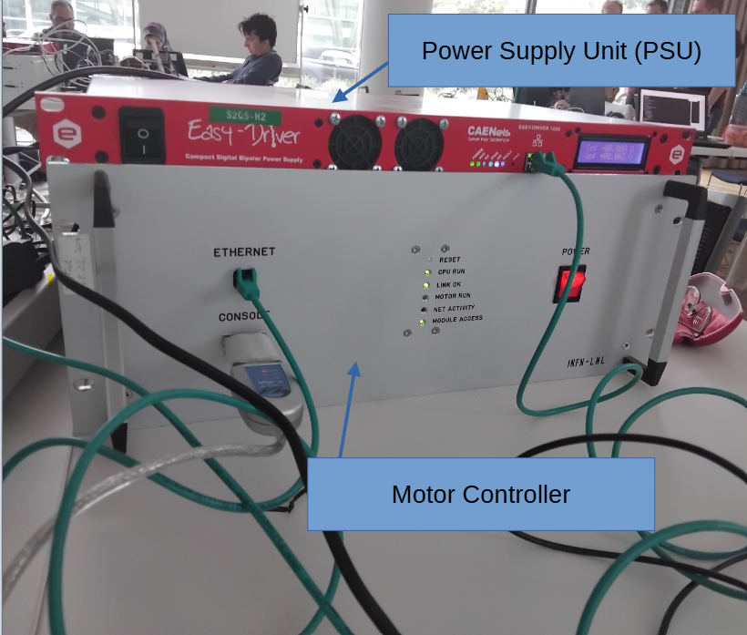
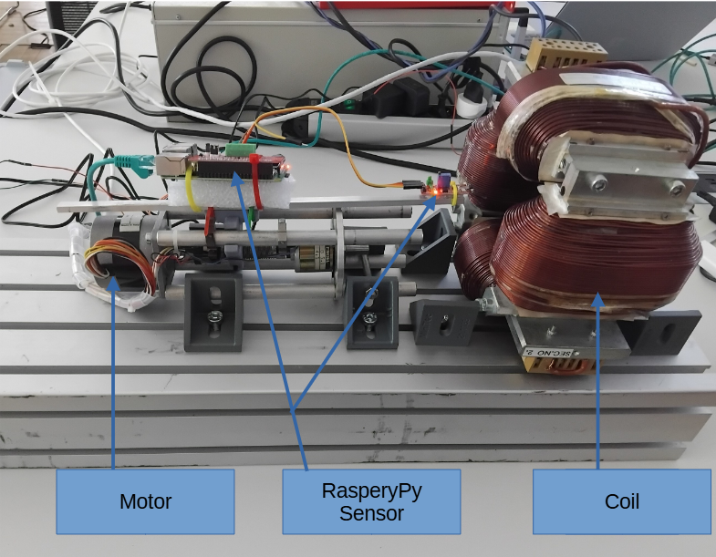

# magnetic_HZB

magnetic_HZB is a Python project for **controlling a magnetic-measurement bench** and
**analysing the acquired data**.  
The setup was built during a laboratory at **HZB** and combines motor control, a current
power supply, and a Raspberry Pi magnetic sensor to characterise the field generated by a coil.

---

## Experimental setup

### Rack electronics

The rack hosts the **power supply unit (PSU)** that drives the coil and the **motor controller**
for the linear stage.

- **Power Supply Unit (PSU)** – provides programmable current to the magnet/coil.
- **Motor controller** – controls the linear motor, exposes Ethernet/console interfaces,
  and reports the status of the motion system (CPU RUN, MOTOR RUN, LINK OK, …).

### Mechanical bench

The mechanical bench contains the moving parts and the field source.

- **Motor + linear stage** – moves the magnetic sensor along the measurement axis.
- **Raspberry Pi + magnetic sensor** – reads the magnetic field and logs/streams data.
- **Coil** – generates the magnetic field under test, powered by the PSU.

---

## Project goals

- Automate **position scans** and **current ramps**.
- Acquire **synchronised current, position and magnetic field** measurements.
- Provide reusable Python tools for:
  - experiment configuration,
  - running scans (field vs. position / time / current),
  - saving data (CSV, NumPy, …),
  - producing publication-quality plots and basic analysis.

---

## Features

- High-level Python API to:
  - connect to the PSU and motor controller,
  - define scan trajectories and current profiles,
  - start/stop experiments safely.
- Simple configuration through a single config file (YAML/JSON or Python dict).
- Data logging with timestamps and metadata (scan type, limits, step size, etc.).
- Example analysis scripts / notebooks for:
  - field vs. position curves,
  - hysteresis (field vs. current),
  - basic statistics on field homogeneity.

